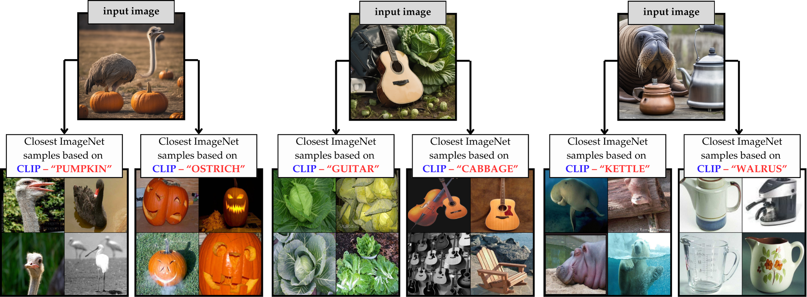
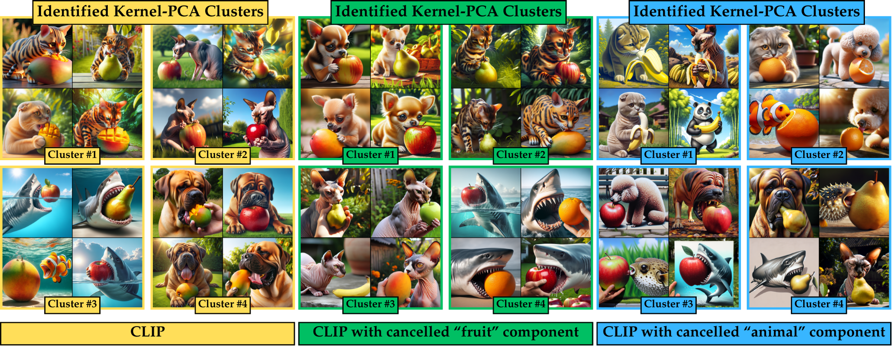
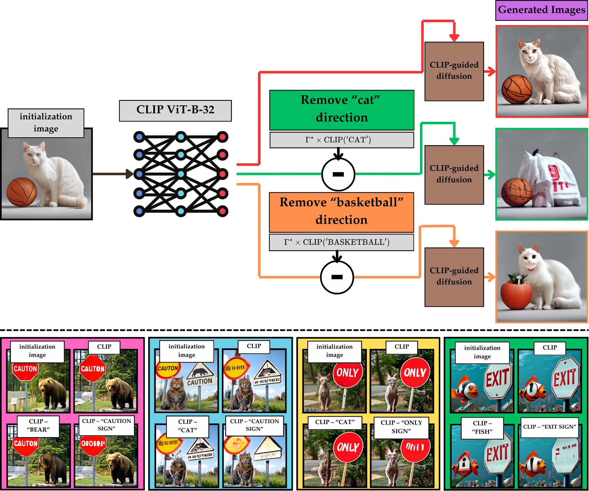

# SCE Score and CLIP Decomposition
A GitHub repository accompanying a "Dissecting CLIP: Decomposition with a Schur Complement-based Approach" paper



## Initializing SCE
To compute SCE score presented in the paper, initialize SCE with the following:
```python
from SCE.metric.SCE import SCE_Evaluator
from SCE.datasets.ImageFilesDataset import ImageFilesDataset

sigma = 3.5
fe = 'clip'

result_name = 'your_result_name'

img_pth = 'path_to_images'
text_pth = 'path_to_text.txt'

with open(text_pth, 'r') as f:
    prompts = f.readlines()
image_dataset = ImageFilesDataset(img_pth, name=result_name, extension='PNG')

SCE = SCE_Evaluator(logger_path='./logs', batchsize=64, sigma=sigma, eta=0, num_samples=num_samples, result_name=result_name, rff_dim=2500, save_visuals_path=f'visuals_{result_name}')
SCE.set_schur_feature_extractor(fe, save_path='./save')
```
In this snippet, parameter _sigma_ controls the bandwidth of the Gaussian Kernel and _fe_ allows to choose a specific feature extractor. In this repository we provide an implementation for CLIP, but other feature extractors may be used. We note that to access T2I and I2T evaluations, the feature extractor should support encoding of both text and image domains. 

## Computing SCE Score
To calculate the SCE Score for a paired text-image dataset, use the following function:
```python
# Get SCE Scores
img_generator_diversity, text_prompt_diversity = SCE.sce_score(prompts, image_dataset)
```
This function returns two components of diversity, decoupled as follows:
- Text Prompt Diversity: Measures the variability originating from the text sources.
- Image Generator Diversity: Measures the variability originating from the image sources.

## Clustering with SCE

The script enables clustering of images after applying SCE CLIP embedding correction based on prompts. Use the following function:
```python
# Cluster Results
SCE.rff_schur_clustering_modes_of_dataset(prompts, image_dataset)
```
Note that top images, number of modes and sensitivity (_sigma_ parameter) are adjustable. The results are stored in location specified in _save_visuals_path_.

## Removing directions from CLIP embedding

SCE framework allows to remove features and directions from the CLIP embedding using the following functions:
```python
# Initialise images/texts to correct
img_pth_to_correct = 'path_to_correction_images'
text_pth_to_correct = 'path_to_correction_text.txt'

with open(text_pth_to_correct, 'r') as f:
    prompts_to_correct = f.readlines()
image_dataset_to_correct = ImageFilesDataset(img_pth_to_correct, name=result_name, extension='PNG')

# Correct embeddings in T2I tasks (remove features from an image given a text description)
corrected_t2i_embedding = SCE.corrected_embedding_t2i(prompts_to_correct, image_dataset_to_correct, prompts, image_dataset)

# Correct embeddings in I2T tasks (remove features from a text caption given an image)
corrected_i2t_embedding = SCE.corrected_embedding_i2t(prompts_to_correct, image_dataset_to_correct, prompts, image_dataset)
```
This repository provides correction for I2T, T2I and T2T tasks with CLIP embeddings. We note that SCE framework can be extended to non-CLIP family of embeddings to perform embedding correction under T2T and I2I tasks, i.e. when there is no mixture of data domains. 
We also note that SCE framework requires preliminary data to construct optimal correction matrix $\Gamma^*$. It is automatically saved, so you only need to compute it once and then it could be reused. 

## Datasets used
We provide access to datasets as follows:
- [Sharepoint Link](https://mycuhk-my.sharepoint.com/:f:/g/personal/1155133928_link_cuhk_edu_hk/EqRyXvuRjURIltCtoVK1T7kBWvKXasvbhxOyg7qCFZwQgg?e=L751H5)
- [SDXL generated animals with objects](https://huggingface.co/datasets/aziksh/animals_with_objects_sdxl)
- [DALL-E 3 generated animals eating fruits](https://huggingface.co/datasets/aziksh/animals_with_fruits_dalle3)


This `README.md` file provides a clear and concise guide for users to understand and run the demo script, including installation instructions, usage examples, and parameter explanations. Adjust the paths and filenames in the script to match your specific environment and dataset.


